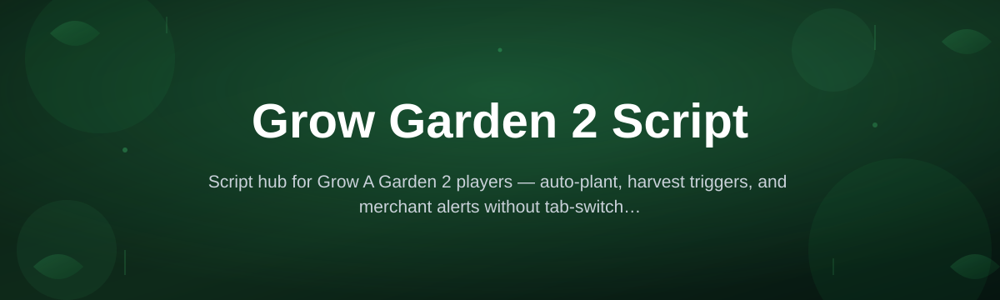
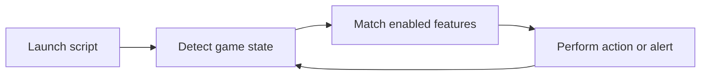

# grow-a-garden-2-script-hub

*A tidy, no-fuss companion for Grow A Garden 2 players who'd rather spend their evening actually gardening than clicking through the same menus forty times.*

## What this is

grow-a-garden-2-script-hub is the project page and index for a Grow A Garden 2 Script — a lightweight Windows tool built for players of the Roblox game Grow A Garden 2. It exists because a lot of the repetitive parts of the game (checking shop stock, watching timers, re-clicking the same sequence of menus) eat more time than the actual planning and trading does. This repo is where the script lives, gets described, and gets versioned, with the actual download hosted on the linked project page.

The tool itself is a standalone helper, not a mod and not a game client replacement. It runs alongside your existing Roblox session and focuses on the parts of Grow A Garden 2 that benefit from automation or better visibility — things like tracking events, surfacing info the default UI buries, and cutting down on repetitive manual steps. If you've searched for a Grow A Garden 2 Script because the grind started feeling like a second job, this is built for that exact frustration.

  

The button above opens the project's landing page, where the current build is hosted for download.

## Who it is for

- **Long-session growers** who log serious hours and want fewer repetitive clicks per session.
- **Trading-focused players** who need faster visibility into stock, prices, or event timers.
- **Returning players** picking Grow A Garden 2 back up after a break and wanting a smoother re-entry.
- **Server or group organizers** coordinating events and wanting consistent, repeatable tooling across members.
- **Anyone on Windows** who prefers a small standalone utility over juggling browser tabs and spreadsheets.

## What you can do

- **Track shop and seed stock** so you're not refreshing menus manually.
- **Get timer alerts** for restocks, events, and other time-sensitive in-game moments.
- **Automate repetitive click sequences** for tasks you already do every session.
- **Surface hidden info** the base game UI doesn't show clearly at a glance.
- **Save and reuse setups** instead of reconfiguring preferences each time you launch.
- **Run lightweight in the background** without a heavy install or startup delay.
- **Toggle features independently**, so you only use the parts you actually want.
- **Update without extra setup** — new builds are published to the same landing page.

<strong>Getting started</strong>

## Getting started

1. Open the landing page using the download button above.
2. Download the latest build listed there for Windows.
3. Extract or place the file wherever you keep your tools — no installer wizard involved.
4. Run it, then launch or switch to Grow A Garden 2 as you normally would.
5. Enable the features you want from the tool's interface; leave the rest off.

<strong>Requirements</strong>

## Requirements

- Windows 10 or Windows 11 (64-bit).
- No development toolchain, compiler, or package manager needed.
- Standalone executable — nothing to build from source to get running.
- A working Roblox installation with Grow A Garden 2 already playable.
- Basic familiarity with running a downloaded `.exe` on your own machine.

## How it works

The script sits between your inputs and the game window, watching for the states it's designed to react to, then acting on the ones you've enabled.

1. On launch, it attaches to your running Grow A Garden 2 session.
2. It reads visible game state — stock, timers, menu context.
3. It checks that state against whichever features you've turned on.
4. It performs the relevant action or shows you an alert.
5. It loops back and keeps watching until you close it.

<strong>FAQ</strong>

## FAQ

**Is this an official Grow A Garden 2 tool?**
No. It's an independent, community-built script for players — it isn't made or endorsed by the game's developers.

**Will this get my account banned?**
Any third-party tool carries some risk with the game's terms of service. Use your own judgment, and consider testing on an account you're comfortable risking before relying on it daily.

**Does it work on Mac or mobile?**
Not currently. The build here targets Windows 10/11 specifically.

**Do I need to reinstall Roblox or change game files?**
No. It runs alongside your existing Roblox setup without touching game files directly.

**Why isn't the download in this repository?**
Builds are hosted and versioned on the linked landing page so updates roll out without cluttering repo history.

<strong>Troubleshooting</strong>

## Troubleshooting

- **Script won't launch:** confirm you extracted the full download rather than running it from inside a zip archive.
- **Windows flags the file on first run:** this is common for unsigned standalone tools; check the file properties and unblock it if your system holds it back.
- **Features don't seem to trigger:** make sure Grow A Garden 2 is the active window and that the relevant feature toggle is actually enabled.
- **Nothing updates after a new release:** re-download from the landing page — the tool doesn't auto-update itself.

## License

This project is released under the [MIT License](LICENSE). It's provided as-is, with no warranty — use it at your own discretion and in line with the game's terms of service.

  

